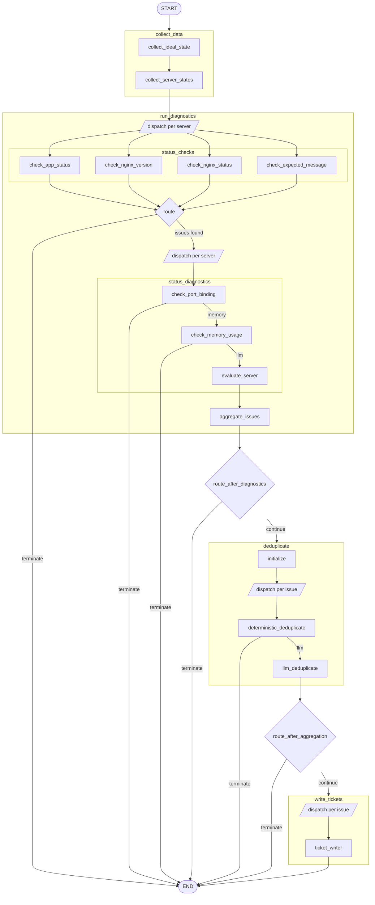
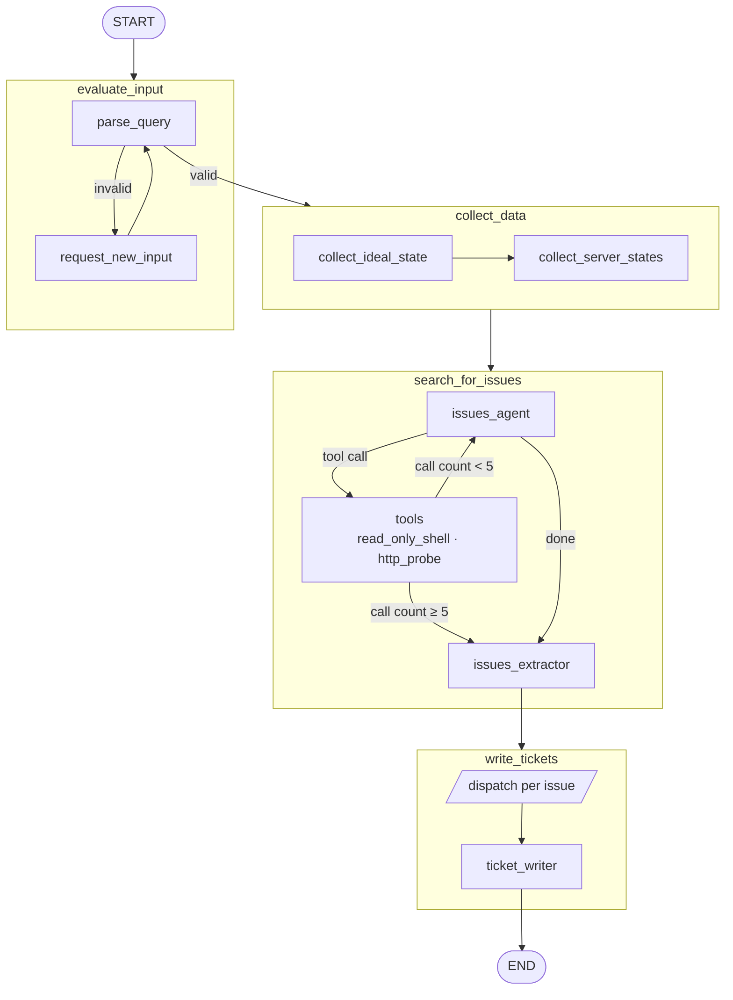

# Server Ticket Debugger

An agentic server-health monitoring system built with LangGraph. It connects to a cluster of servers, diagnoses nginx and application-level issues, deduplicates findings with an LLM, and writes structured support tickets to disk. A second **audit** mode accepts a natural-language query and searches for matching issues across a cluster.

---

## Workflows

### Run (standard diagnostics)



| Subgraph | Responsibility |
|---|---|
| `collect_data` | Loads baseline config; fetches nginx status, version, and app response from every server |
| `run_diagnostics` | Dispatches per-server status checks in parallel; runs deep diagnostics on failing servers; aggregates candidate issues |
| `deduplicate` | Deterministic fuzzy dedup followed by LLM dedup to filter noise and merge near-duplicates |
| `write_tickets` | Dispatches one LLM-written Markdown ticket per confirmed issue to `tickets/` |

The graph terminates early (before deduplication or ticket writing) if no issues are found at the preceding stage.

---

### Audit (query-driven investigation)



| Subgraph | Responsibility |
|---|---|
| `evaluate_input` | Parses the natural-language query with an LLM; loops on `request_new_input` until the query is valid |
| `collect_data` | Same as the run workflow |
| `search_for_issues` | ReAct agent with `read_only_shell` and `http_probe` tools; capped at 5 tool calls, then hands off to `issues_extractor` |
| `write_tickets` | Dispatches one ticket per confirmed finding |

---

## Prerequisites

- **Docker + Docker Compose** (recommended)
- or: Python 3.11+ and Node 18+ for local development

---

## Quick Start

### Docker (recommended)

```bash
# Fill in your keys (see Environment Variables below)
# then:
docker-compose up
```

| Service | URL |
|---|---|
| Frontend | http://localhost:5173 |
| API | http://localhost:8000 |
| API docs | http://localhost:8000/docs |

The compose file also starts three pre-configured test clusters (A, B, C) with intentional faults.

### Local

```bash
pip install -r Requirements.txt
python api.py          # API on :8000
```

Frontend (separate terminal):

```bash
cd frontend
npm install
npm run dev            # UI on :5173
```

---

## Environment Variables

Create a `.env` file in the project root:

| Variable | Required | Description |
|---|---|---|
| `OPENAI_API_KEY` | Yes | Used for all LLM nodes |
| `MODEL_CHOICE` | Yes | Model name, e.g. `gpt-4o` |
| `LANGSMITH_API_KEY` | No | Enables LangSmith tracing |
| `LANGSMITH_TRACING_V2` | No | Set to `true` to activate tracing |
| `LANGSMITH_PROJECT` | No | LangSmith project name (default: `server-ticket-debugger`) |

---

## API

### `POST /run`
Run diagnostics on a cluster and stream results.
```json
{ "cluster_id": "A" }
```

### `POST /audit`
Investigate a specific query against a cluster.
```json
{ "cluster_id": "C", "query": "why are upstream requests failing?" }
```

Both endpoints stream [Server-Sent Events](https://developer.mozilla.org/en-US/docs/Web/API/Server-sent_events) so the UI can display progress in real time.

### `GET /health`
Returns `200 OK` when the API is running.

---

## Configuration

`config/expected_config.json` defines the baseline state used during diagnostics:

```json
{
  "expected_nginx_version": "1.26.2",
  "expected_nginx_status": "running",
  "expected_app_status": "ok",
  "clusters": {
    "A": { "expected_message": "I am a cluster A server!" }
  }
}
```

Any server deviating from these values is flagged as a candidate issue.

---

## Project Structure

```
app/
  graphs/         # LangGraph workflow definitions
  nodes/          # Individual node logic (collect, diagnose, deduplicate, write)
  state/          # Typed graph state (MainState, AuditState)
  models/         # Pydantic data models
  config/         # App-level config loading
config/           # expected_config.json
servers/          # Mock nginx server configs for test clusters
frontend/         # React + Vite UI
tickets/          # Generated ticket output
main.py           # CLI entry point
api.py            # FastAPI server
```

---

## CLI Usage

```bash
# Run diagnostics on cluster A (default)
python main.py

# Target a specific cluster
python -c "from main import start_run; start_run('B')"

# Audit mode
python -c "from main import start_audit; start_audit('C', 'upstream errors')"
```
